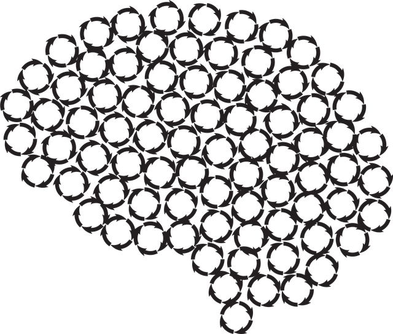

# SynapseCraft

A program that turns pictures into weights and biases for neural networks

## Getting Started
These instructions will get you a copy of the project up and running on your local machine for development and testing 
purposes. See deployment for notes on how to deploy the project on a live system.

### Prerequisites
Download SynapseCraft-installer on release

### Installation
1. Change directory to install from you computer
2. Check the box - create a shortcut on the screen
3. Launch the application
4. Chose images files
5. Add files to list boxes
6. Enter values in text fields
7. Press generate

## Authors
Daniil Parhin - initial works
